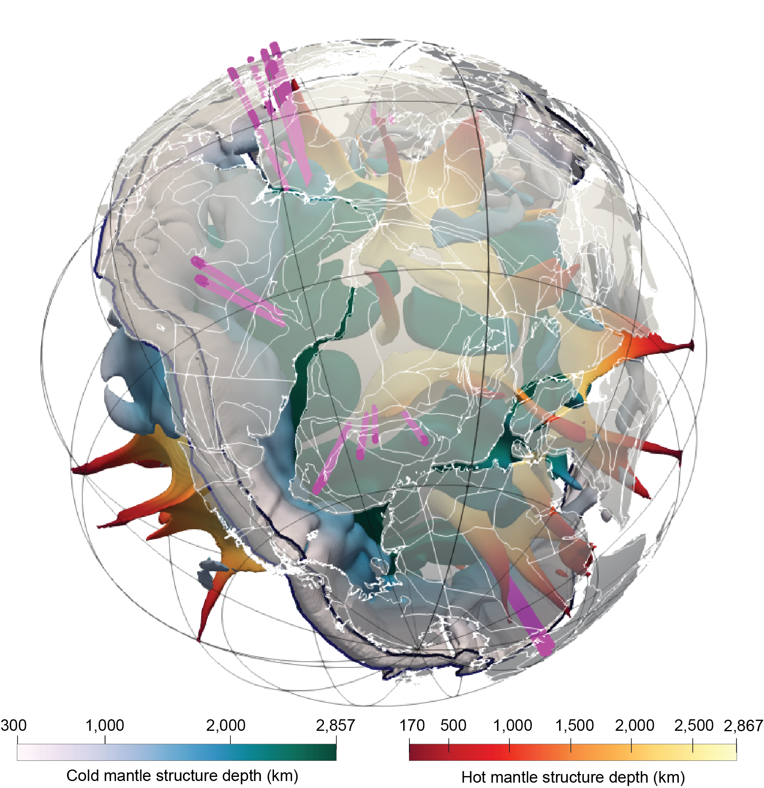

# Joint-4D-Visualisation-and-Analysis-of-Geodynamic-Models-and-Geological-Data

#### Figure 1. A snapshot of 3D Visualisation of CitcomS geodynamic model output for Case 6 in Flament et al. (2022), at 180 Ma. Holes are virtually drilled at reconstructed kimberlite emplacement locations, presented as magenta columns extending from surface to the core-mantle boundary.

This repository is complementary to the manuscript "Joint-4D-Visualisation-and-Analysis-of-Geodynamic-Models-and-Geological-Data" in review. 

It includes Python (3.8) and shell scripts, each referenced to the article in regard to their purpose of creation and/or modification from existing open-source codes. A sample CitcomS geodynamic model output for a single timestep (180 Ma) is also shared for the purpose of enabling users to test the framework in their own platforms. 

I always appreciate feedback to improve this repository.

Dr Ömer F. Bodur

University of Wollongong

Email: omer@uow.edu.au

Flament, N., Bodur, Ö. F., Williams, S. E. and Merdith, A. S.: Assembly of the basal mantle structure beneath Africa, Nature, 603(7903), 846–851, 2022.
